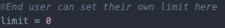

# cli-budget-manager
### What is the cli-budget-manager?
This is a simple Python script which allows you to take control of your budget and warns you if you surpasses the allowed limit. Functionalities also include a tip giver if you would like to take money saving to the max.

### How do I use it?
Its rather simple actually.

##### First, set up a limit:
- In the source code, you will find a limit variable on top defaulted to 0. Adjust to your likings.

##### Second, dependencies:
- Download the 2 dependencies needed for this program: json and columnar
- Using pip, type the command into your command window: pip install <name of dependency>
- If the above instruction doesn't work, try python3 -m pip install <name of dependency>
- If both ways don't work for you, try reinstalling Python at https://python.org
  
##### Fire it up:
- Turn on the command prompt or terminal.
- cd into the folder's location
- Type python3 main.py
  
##### Further questions?
- Instructions will continue within the program. If you have any inquires, please post a ticket in the Issues tab.
